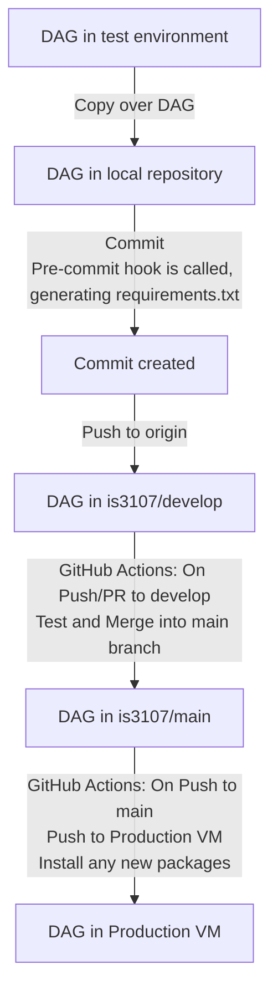
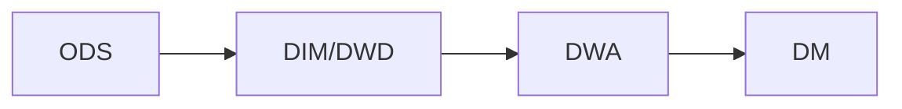

IS3107 Airflow Group Project
============================

GitHub Repository: https://github.com/is3107/airflow_dags

<br/>

Alternatively, if you are viewing this README on the VM itself, and are using Visual Studio Code:
* Open Preview (Windows: `Ctrl+Shift+V` &nbsp; Mac: `⇧⌘V `)
* For the best viewing experience, please install [GitHub Markdown Preview](https://marketplace.visualstudio.com/items?itemName=bierner.github-markdown-preview) and [Markdown Preview Mermaid Support](https://marketplace.visualstudio.com/items?itemName=bierner.markdown-mermaid)
* Ensure that this extension is also installed under SSH in the Extensions sidebar (Windows: `Ctrl-Shift-X` &nbsp; Mac: `⇧⌘X`)


## Getting Started

### Important Links

* Airflow Web App for Dev VM: [`https://dev.is3107.live/`](https://dev.is3107.live/)

* Airflow Web App for Production VM [`https://is3107.live/`](https://is3107.live/)
    * TODO Not up yet -> Currently just redirects to Dev VM :upside_down_face: 

### First-time Setup
1. SSH into the Dev VM:

    ```sh
    ssh -i "path-to-your-private-key" username@34.127.0.57
    ```

    <details><summary><b>FAQ</b></summary>

    * Unable to locate path/file:

        **Answer**: Ensure that your path is enclosed by quotation marks.
    
    <br/>

    * SSH host key fingerprint does not match:

        **Answer**: Find your known_hosts file and delete the entry for `34.127.0.57`

    </details>
<br/>

2. Login into your GitHub account via GitHub CLI:

    ```sh
    gh auth login
    ```
    
    This step provides Git with your credentials for pushing to the repository on GitHub.

    <br/>
    [Optional] You may logout once you are done working:

    ```sh
    gh auth logout
    ```
<br/>

3. Join the is3107 GitHub organization:

    ```sh
    gcloud functions call github-add-user-is3107 --data='{"username":"your_github_username"}' --region='us-west1'
    ```

    You will receive an invitation email. Accept it to join the organization. This step is **REQUIRED** in order to push to the repository.
    <br/>
<br/>

4. Whitelist your Google Account email:
    <br/>

    Navigate to `/home/is3107/airflow` and open the file `webserver_config.py`

    ```py
    OAUTH_PROVIDERS = [{
        'name':'google',
        'whitelist':['other_email','add_your_email_here']
    ```

    This step will grant you access to the Airflow webserver. We use Google OAuth for webserver authentication. Unfortunately, we have to rely on a local whitelist as Google's test user functionality is currently [broken](https://issuetracker.google.com/issues/211370835).
    <br/>
<br/>

## Workflow

### The Short Version

1. Activate virtual environment
    ```sh
    source /home/is3107/is3107/bin/activate
    ```
2. Write your code in `/home/is3107/airflow/dags`

3. Test your code

4. Deploy your DAG file. 
    * Copy it to `/home/is3107/airflow/airflow_dags/dags`
    * Commit via Git
    * Push to GitHub Repository

### The Nitty-Gritty

#### Virtual Environment

Airflow is currently installed in the `is3107` [virtual environment](https://docs.python.org/3/library/venv.html). As such, you need to activate this virtual environment first for the necessary airflow packages to be present.

```sh
source /home/is3107/is3107/bin/activate
```

You can deactivate the virtual environment afterwards with a simple command to terminal:
```sh
deactivate
```

While you may clone and create your own separate virtual environment during testing, please ensure that you also install any newly added packages into `is3107` before committing and deploying.

<br/>

#### Testing

You may refer to Airflow's [documentation](https://airflow.apache.org/docs/apache-airflow/stable/tutorial.html#testing) for an idea on how to get started testing.

You can also test triggering your DAG from the webserver:
[`https://dev.is3107.live/`](https://dev.is3107.live/)

**Note**: As Airflow has been [configured](#airflow) to integrate with `systemd`, there is no need to manually start and kill Airflow processes via `airflow webserver / scheduler` commands.

<br/>

#### DAG Directories

Since it is possible for multiple people to be logged onto the Dev VM and working on code at the same time, the Airflow DAG directory is kept separate from the local clone of the GitHub repository.<br/>

This avoids the case where: Dev A has completed their DAG and is committing/pushing it, while Dev B is still testing their code in the same DAG directory, resulting in incomplete code being pushed to production.

<br/>

The directories are thus as follows:

`/home/is3107/airflow/dags`: The Dev VM's Airflow DAG directory. Use this as a test environment for writing your code and testing your DAGs.

`/home/is3107/airflow/airflow_dags`: The local clone of the GitHub repository. Only place your DAGs into the `dags` folder once you have completed testing and wish to deploy it.

<br/>

#### CI/CD Pipeline



As seen from the above diagram, the only actions that a developer needs to take are to:

1. Copy over their DAG
2. Commit
3. Push

The automated actions perform these functionalities:

1. Pre-commit hook: 
    * Automatically generates and updates `requirements.txt`
        * Script can be found in the repository at: `requirements/create-requirements.sh`
    * `requirements.txt` is used to replicate the packages installed in the Dev VM onto the Production VM
    * Pre-commit config can be found in the repository at:  `.pre-commit-config.yaml`
    * For more information, you can refer to [pre-commit](https://pre-commit.com/)

2. GitHub Actions (On Push/PR to *develop*):
    * Runs a test suite on the DAGs, before merging the *develop* branch into *main*
    * Workflow can be found in the repository at: `.github/workflows/Test_CI.yml`
    * Tests run are also located in the repository at: `tests/tests.py`

3. GitHub Actions (On Push to *main*): (TODO)
    * Automatically triggered by the above GitHub Action
        * A successful merge of *develop* branch into *main*  is recognised as a push
    * SSH into the Production VM
        * git pull from *main*
        * pip install using `requirements.txt`
    * Workflow can be found in the repository at: `fill-in-when-done`

## Architectural Overview


### NGINX

We use NGINX as a reverse proxy, which allows us to:

* Automatically redirect HTTP traffic to HTTPS

* Forward SSL port 443 to Airflow Webserver port 8080

* Set and refresh our SSL certificates with `Certbot`

While we would ideally have just 1 NGINX instance in a separate VM redirecting traffic to our Dev and Prod VMs for security reasons, we were unable to do so due to cost concerns

<details><summary><b>Example</b></summary>
TODO

:upside_down_face: 

Add Diagram here
</details>

### Airflow

Both the Airflow Webserver and Scheduler have been integrated with [`systemd`](https://airflow.apache.org/docs/apache-airflow/stable/howto/run-with-systemd.html) to automatically start up on system start

Managing the Webserver and Scheduler services should be done via `systemctl` commands:

```sh
# The most likely command you will be running is probably restart

sudo systemctl restart airflow-webserver

sudo systemctl restart airflow-scheduler
```

### PostgreSQL

PostgreSQL is used as Airflow's metadata store. This allows for `LocalExecutor` to be used, which in turn enables tasks to be run in parallel.

Querying PostgreSQL can be done via the following steps:

* Log into the postgres user
    ```sh
    sudo su - postgres
    ```

* Activate PostgreSQL's interactive terminal via command:
    ```sh
    psql
    ```

* Connect to the metadata store
    ```bash
    \c airflow_db
    ```

* Run your query

### BigQuery

We use BigQuery as our data warehouse solution

As seen from the above diagram, it is an all-in-one data warehouse solution, capable of serving as:
* Database storage
* Compute cluster
* Serving layer for queries

This allows us to focus on developing the data pipelines for our data warehouse, rather than having to spend effort setting up the architecture ourselves

<details><summary><b>Comparison Example</b></summary>
An example of a data warehouse architecture we could implement ourselves using open-source software:

:upside_down_face: 
<br/>TODO: Add Diagram<br/>
Hadoop HDFS (Storage) - Spark (Compute) - Hive / Presto (Serving Layer)

<br/>
Ultimately, we chose not to do so because it was likely that we would have only been able to deploy 1-2 nodes at most due to cost considerations, defeating the point of implementing a distributed storage and compute architecture.
</details>

## Best Practices

### Data Pipeline Architecture

In general, data in the pipeline will flow as per the diagram below. Between each arrow, several smaller steps of processing and data transformation may exist.



#### Layer Definitions

Table Layer | Definition
--- | ---
**ODS** | **Original Data Source**: The table data that is ingested directly from the original data source. Little to no data cleaning and data processing has been done at this stage.
**DIM** | **Dimensional Table**: This table contains dimensional attributes only. These attributes are usually *descriptive* and/or *categorical* in nature
**DWD** | **Data Warehouse Detail**: This is a detail-level fact table, containing *metrics/numeric measures* that are indexed with a key. <details><summary> **Example** </summary>Price transaction data: Stock Ticker (Key), Price (metric)</details>
**DWA** | **Data Warehouse Aggregation**: This table contains aggregated metrics, obtained from a GROUP BY done on **DWD**-level tables joined with **DIM** tables.
**DM** | **Data Mart**: This table is provided to a specific business-line or department, often focusing on a specific subject area <details><summary> **Example** </summary> Tables that are fed into visualisation platforms for BI purposes </details>

#### Warehouse Schema

TODO :upside_down_face:

Decide on what schema we are following (it is essentially the relationship between DIM and DWD tables) <br/>
Google Snowflake, Star, Galaxy schema

<br/>

### Standardised Naming Scheme

Naming for tasks, DAGs and database tables should follow the following standards:

TODO :upside_down_face:

#### Tasks

#### DAGs

#### DB Tables

## Useful Tools

[Save as Root in Remote - SSH](https://marketplace.visualstudio.com/items?itemName=yy0931.save-as-root)

