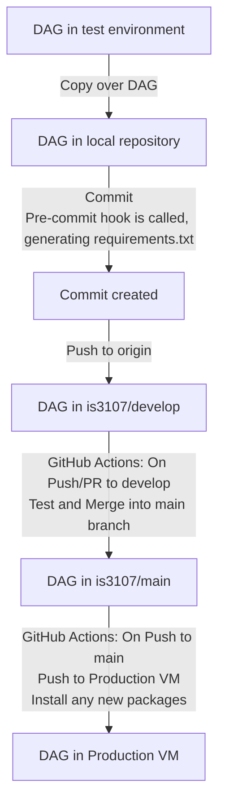
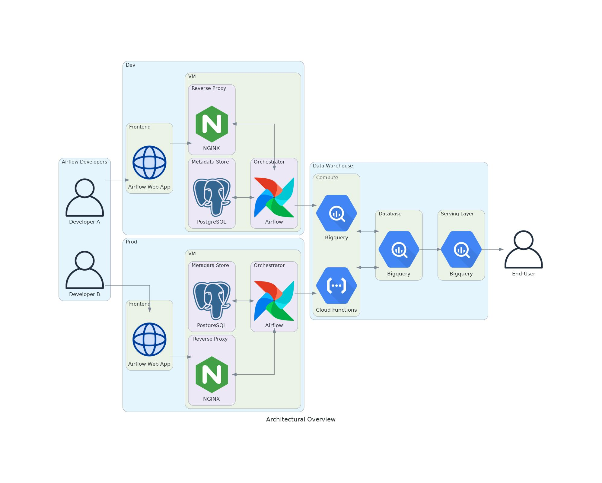
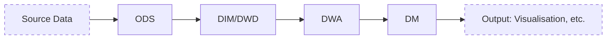
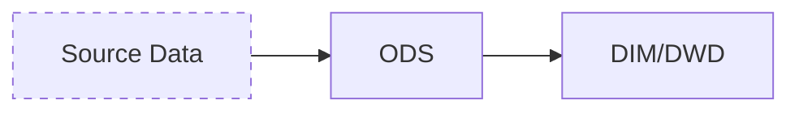
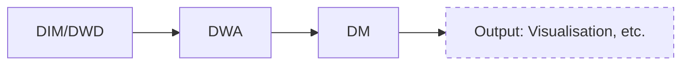
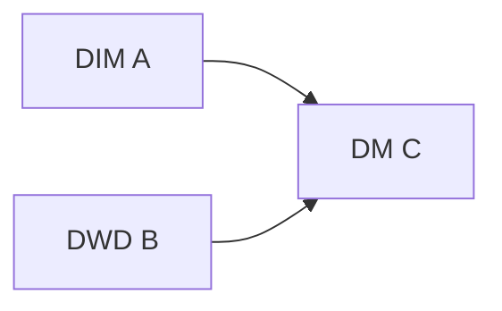
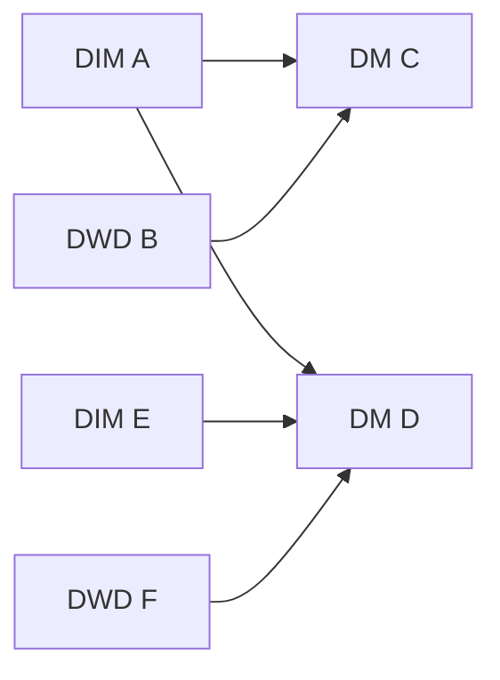

IS3107 Airflow Group Project
============================

GitHub Repository: https://github.com/is3107/airflow_dags

<br/>

Alternatively, if you are viewing this README on the VM itself, and are using Visual Studio Code:
* Open Preview (Windows: `Ctrl+Shift+V` &nbsp; Mac: `⇧⌘V `)
* For the best viewing experience, please install [GitHub Markdown Preview](https://marketplace.visualstudio.com/items?itemName=bierner.github-markdown-preview) and [Markdown Preview Mermaid Support](https://marketplace.visualstudio.com/items?itemName=bierner.markdown-mermaid)
* Ensure that this extension is also installed under SSH in the Extensions sidebar (Windows: `Ctrl-Shift-X` &nbsp; Mac: `⇧⌘X`)


## Getting Started

### Important Links

* Airflow Web App for Dev VM: [`https://dev.is3107.live/`](https://dev.is3107.live/)
    * VM at `34.127.0.57`

* Airflow Web App for Production VM [`https://is3107.live/`](https://is3107.live/)
    * VM at `35.199.159.0`

### First-time Setup
1. SSH into the Dev VM:

    ```sh
    ssh -i "path-to-your-private-key" username@34.127.0.57
    ```

    <details><summary><b>FAQ</b></summary>

    * Unable to locate path/file:

        **Answer**: Ensure that your path is enclosed by quotation marks.
    
    <br/>

    * SSH host key fingerprint does not match:

        **Answer**: Find your known_hosts file and delete the entry for `34.127.0.57`

    </details>
<br/>

2. Login into your GitHub account via GitHub CLI:

    ```sh
    gh auth login
    ```
    
    This step provides Git with your credentials for pushing to the repository on GitHub.

    <br/>
    [Optional] You may logout once you are done working:

    ```sh
    gh auth logout
    ```
<br/>

3. Join the is3107 GitHub organization:

    ```sh
    gcloud functions call github-add-user-is3107 --data='{"username":"your_github_username"}' --region='us-west1'
    ```

    You will receive an invitation email. Accept it to join the organization. This step is **REQUIRED** in order to push to the repository.
    <br/>
<br/>

4. Whitelist your Google Account email:
    <br/>

    Navigate to `/home/is3107/airflow` and open the file `webserver_config.py`

    ```py
    OAUTH_PROVIDERS = [{
        'name':'google',
        'whitelist':['other_email','add_your_email_here']
    ```

    This step will grant you access to the Airflow webserver. We use Google OAuth for webserver authentication. Unfortunately, we have to rely on a local whitelist as Google's test user functionality is currently [broken](https://issuetracker.google.com/issues/211370835).
    <br/>
<br/>

## Workflow

### The Short Version

1. Activate virtual environment
    ```sh
    source /home/is3107/is3107/bin/activate
    ```
2. Write your code in `/home/is3107/airflow/dags`

3. Test your code

4. Deploy your DAG file. 
    * Copy it to `/home/is3107/airflow/airflow_dags/dags`
    * Commit via Git
    * Push to GitHub Repository

### The Nitty-Gritty

#### Virtual Environment

Airflow is currently installed in the `is3107` [virtual environment](https://docs.python.org/3/library/venv.html). As such, you need to activate this virtual environment first for the necessary airflow packages to be present.

```sh
source /home/is3107/is3107/bin/activate
```

You can deactivate the virtual environment afterwards with a simple command to terminal:
```sh
deactivate
```

While you may clone and create your own separate virtual environment during testing, please ensure that you also install any newly added packages into `is3107` before committing and deploying.

<br/>

#### Testing

You may refer to Airflow's [documentation](https://airflow.apache.org/docs/apache-airflow/stable/tutorial.html#testing) for an idea on how to get started testing.

You can also test triggering your DAG from the webserver:
[`https://dev.is3107.live/`](https://dev.is3107.live/)

**Note**: As Airflow has been [configured](#airflow) to integrate with `systemd`, there is no need to manually start and kill Airflow processes via `airflow webserver / scheduler` commands.

<br/>

#### DAG Directories

Since it is possible for multiple people to be logged onto the Dev VM and working on code at the same time, the Airflow DAG directory is kept separate from the local clone of the GitHub repository.<br/>

This avoids the case where: Dev A has completed their DAG and is committing/pushing it, while Dev B is still testing their code in the same DAG directory, resulting in incomplete code being pushed to production.

<br/>

The directories are thus as follows:

`/home/is3107/airflow/dags`: The Dev VM's Airflow DAG directory. Use this as a test environment for writing your code and testing your DAGs.

`/home/is3107/airflow/airflow_dags`: The local clone of the GitHub repository. Only place your DAGs into the `dags` folder once you have completed testing and wish to deploy it.

<br/>

#### CI/CD Pipeline



As seen from the above diagram, the only actions that a developer needs to take are to:

1. Copy over their DAG
2. Commit
3. Push

The automated actions perform these functionalities:

1. Pre-commit hook: 
    * Automatically generates and updates `requirements.txt`
        * Script can be found in the repository at: `requirements/create-requirements.sh`
    * `requirements.txt` is used to replicate the packages installed in the Dev VM onto the Production VM
    * Pre-commit config can be found in the repository at:  `.pre-commit-config.yaml`
    * For more information, you can refer to [pre-commit](https://pre-commit.com/)

2. GitHub Actions (On Push/PR to *develop*):
    * Runs a test suite on the DAGs, before merging the *develop* branch into *main*
    * Workflow can be found in the repository at: `.github/workflows/Test_CI.yml`
    * Tests run are also located in the repository at: `tests/tests.py`

3. GitHub Actions (On Push to *main*): (TODO)
    * Automatically triggered by the above GitHub Action
        * A successful merge of *develop* branch into *main*  is recognised as a push
    * SSH into the Production VM
        * git pull from *main*
        * pip install using `requirements.txt`
    * Workflow can be found in the repository at: `fill-in-when-done`

## Architectural Overview



### NGINX

We use NGINX as a reverse proxy, which allows us to:

* Automatically redirect HTTP traffic to HTTPS

* Forward SSL port 443 to Airflow Webserver port 8080

* Set and refresh our SSL certificates with `Certbot`

While we would ideally have just 1 NGINX instance in a separate VM redirecting traffic to our Dev and Prod VMs for security reasons, we were unable to do so due to cost concerns

<details><summary><b>Example</b></summary>
TODO

:upside_down_face: 

Add Diagram here
</details>

### Airflow

Both the Airflow Webserver and Scheduler have been integrated with [`systemd`](https://airflow.apache.org/docs/apache-airflow/stable/howto/run-with-systemd.html) to automatically start up on system start

Managing the Webserver and Scheduler services should be done via `systemctl` commands:

```sh
# The most likely command you will be running is probably restart

sudo systemctl restart airflow-webserver

sudo systemctl restart airflow-scheduler
```

### PostgreSQL

PostgreSQL is used as Airflow's metadata store. This allows for `LocalExecutor` to be used, which in turn enables tasks to be run in parallel.

Querying PostgreSQL can be done via the following steps:

* Log into the postgres user
    ```sh
    sudo su - postgres
    ```

* Activate PostgreSQL's interactive terminal via command:
    ```sh
    psql
    ```

* Connect to the metadata store
    ```bash
    \c airflow_db
    ```

* Run your query

### BigQuery

We use BigQuery as our data warehouse solution

As seen from the above diagram, it is an all-in-one data warehouse solution, capable of serving as:
* Database storage
* Compute cluster
* Serving layer for queries

This allows us to focus on developing the data pipelines for our data warehouse, rather than having to spend effort setting up the architecture ourselves

<details><summary><b>Comparison Example</b></summary>
An example of a data warehouse architecture we could implement ourselves using open-source software:

:upside_down_face: 
<br/>TODO: Add Diagram<br/>
Hadoop HDFS (Storage) - Spark (Compute) - Hive / Presto (Serving Layer)

<br/>
Ultimately, we chose not to do so because it was likely that we would have only been able to deploy 1-2 nodes at most due to cost considerations, defeating the point of implementing a distributed storage and compute architecture.
</details>

### Cloud Functions

Cloud Functions serves as our secondary compute cluster, supplementing BigQuery. Its use-case is for scenarios where making use of BigQuery is impossible. 

For example, pre-processing tasks in an ingestion DAG. Making use of BigQuery here is not possible given that the data isn't even loaded into BigQuery yet. Loading the data first, and then conducting the processing steps is also not possible, since such pre-processing is often **required** to load the data into BigQuery. Examples include: 

* Formatting column names
* Adding partition date column 

#### Airflow as an Orchestrator

Cloud Functions allows us to offload such pre-processing tasks to a serverless compute cluster. This ensures that Airflow remains focused on its role as an orchestrator. 

This is particularly important - doing pre-processing in the DAG itself, and thus in Airflow - is by nature inefficient, and could prove disastrous especially when the size of the dataset scales up. Processing big data could result in Out-Of-Memory errors on the small VM that we have Airflow on. Making use of Cloud Functions, which has the ability to scale up and down to handle varying workloads, helps to neatly solve this issue.

#### Cloud Functions Usage

Our workflow for Cloud Functions is simple.

1. Generate `requirements.txt` and package it together with the code in a `.zip` file

2. Deploy to Google Cloud if hashes of local and cloud source files do not match

3. Invoke the Function

This has been defined as a custom operator (See `templates/IngestionOperator.py`) and will often be run as the first task in an Ingestion DAG. The DAG itself thus also handles the CI/CD of the Cloud Function itself, ensuring that any changes to the Cloud Function code will be propagated to Google Cloud at the start of the DAG run.


## Data Pipeline Architecture

In general, data in the pipeline will flow as per the diagram below. Between each arrow, several smaller steps of processing and data transformation may exist.



### Layer Definitions

Table Layer | Definition
--- | ---
**ODS** | **Original Data Source**: The table data that is ingested directly from the original data source. Little to no data cleaning and data processing has been done at this stage.
**DIM** | **Dimensional Table**: This table contains dimensional attributes only. These attributes are usually *descriptive* and/or *categorical* in nature
**DWD** | **Data Warehouse Detail**: This is a detail-level fact table, containing *metrics/numeric measures* that are indexed with a key. <details><summary> **Example** </summary>Price transaction data: Stock Ticker (Key), Price (metric)</details>
**DWA** | **Data Warehouse Aggregation**: This table contains aggregated metrics, obtained from a GROUP BY done on **DWD**-level tables joined with **DIM** tables.
**DM** | **Data Mart**: This table is provided to a specific business-line or department, often focusing on a specific subject area <details><summary> **Example** </summary> Tables that are fed into visualisation platforms for BI purposes </details>

### Warehouse Schema

Instead of pre-defining a particular warehouse schema such as Star or Snowflake, we are instead going with a **schema-on-read** approach

This provides a greater level of flexibility when dealing with the organisation of our data, and also allows for greater agility in terms of responding to new requirements

### DAG Modelling

Instead of having a DAG file encompass the entire pipeline end-to-end, we are instead splitting the entire pipeline into 2

#### Ingestion

An ingestion DAG will handle extracting data from the source, staging it in the ODS layer, and extracting useful data columns into the DIM and DWD layers

#### Analytics

An analytics DAG will extract data from the DIM/DWD tables, conduct various steps of transformations and aggregations into the DWA and subsequently the DM layers, before transmitting the data to its final output destination.

#### Rationale

Lets say we have a pipeline which produces DIM table A and DWD table B. After much transformation, they eventually result in DM table C. 

**DAG File**:


However, there is a new requirement for DM table D. D is dependent on A, as well as DIM/DWD tables E and F. 

*Note*: It is unreasonable to subscribe to the notion that each pipeline in a data warehouse is independent of each other. More often than not, there are cross-pipeline dependencies, as data engineers seek to simply reuse tables, building upon the work done by other engineers.

</br>

If we were to keep to the methodology that the entire pipeline should be on one DAG file, then the task producing D should be added to the DAG file, **ALONG** with the tasks producing E and F.

**DAG File**:


As the company's data requirements, and the number of data pipelines scales up, the entire DAG file gets increasingly complex. This creates issues in terms of scalability and code maintainability.

However, by instead looking at the entire pipeline as an ingestion pipeline followed by an analytics pipeline, we are able to modularise it into separate DAGs that are far easier to maintain and follow along.

For anyone wishing to have a bird's eye view of the overall picture, they are still able to do so via Airflow's cross-DAG dependency view.

<br/>

## Standardised Naming Scheme

Naming for tasks, DAGs and database tables should follow the following standards:


### DB Tables

The complete table syntax in BigQuery follows the following format: 

```
<project_name>.<dataset_name>.<table_name>
```
Example: `is3107.lti_ods.ods_finviz_stock_performance_daily`

- Project Name
    - Already pre-defined as `is3107`

- Dataset Name
    - Format: `<warehouse_name>_<layer>`
    - Example: (Long-Term Investment Warehouse)
        ```
        lti_ods
        ```


- Table Name
    - Format: `<layer>_<data_description>_<granularity>`
    - Example: `ods_finviz_stock_performance_daily`
    - **Layer** is repeated here for consistency with [DAG task names](#dag-tasks)
    - **Data description** should concisely describe what kind of data is in this table
        - For example: `source_a_sgx_stock_price` `all_ratings_info`
        - Underscore character `_` should be used to separate words
    - **Granularity** refers to the time granularity of the data
        - Frequently used: `daily` `hourly` `historical`
        - `daily` here would be used to refer to daily snapshot tables (contains data from a daily batch job)
        - `historical` would be a table that *accumulates* data from an upstream daily snapshot table, giving a full view of the data

- Column Name
    - Format: `Pascal_Snake_Case`


### DAGs

#### Ingestion
DAGs should follow this naming format:

```
ingestion_<source>2<destination>_<data_description>
```

For example: `ingestion_finviz2bq_stock_performance`

#### Analytics
DAGs should follow this naming format:

```
analytics_<description_of_eventual_data_output>
```

For example: `analytics_portfolio_performance`


### DAG Tasks

Tasks should follow this naming format:

```
<table_name_that_the_task_writes_into>
```

For example, if a task uses the `BigQueryInsertJobOperator` to read from various tables, and writes the result into the table `lti_dwd.dwd_all_ratings_info_daily`, the task should be named `dwd_all_ratings_info_daily`

This consistency will allow for a developer to navigate between task and table more easily.

</br>

**Exceptions**:
In some cases, writing to a BigQuery table is not accomplished within 1 task. In that case, the tasks should be organised in a task group via the task group decorator [`@task_group`](https://marclamberti.com/blog/airflow-taskgroups-all-you-need-to-know/#The_Decorator), and the task group shall follow the above naming format.

The nested tasks within the task group should then have names that appropriately and concisely describe their actions.

## Best Practices

### Table Partitions

The majority of our tables will be partitioned on day. The data available in the partition can be of 2 kinds:
* Daily data 
    * Data that has a natural day split, such as transactions
* Snapshot data 
    * Aggregated data, where each partition is a historical snapshot of the current state of data on that day itself

Table partitioning provides several advantages:
1. Data idempotency
    * Particularly in the case of aggregated data, snapshotting it via partitions allows for backfilling and reruns to be done easily
    * For unpartitoned tables, `INSERTS/DELETES` over the past few days would mean that a rerun would generate different results

2. Reducing data scanned
    * A query on an unpartitioned table would likely conduct a whole table scan even when fitering by day. In comparison, the day partitioning will guarantee that only data from this partition is scanned
    * This helps with both query speed, and cost

### Time-Zone Aware DAG

Airflow provides time-zone aware DAGs. However, the templating variables provided will not follow time-zone settings, and are instead UTC0. Please use `dag_run.logical_date.astimezone(dag.timezone)` in your templates instead.

For example:
```py
## Original YYYY-MM-DD
{{ ds }}

## Timezone aware YYYY-MM-DD
{{ dag_run.logical_date.astimezone(dag.timezone) | ds }}
```

Please refer to [Airflow Templates](https://airflow.apache.org/docs/apache-airflow/stable/templates-ref.html) for more filters on formatting the timezone aware datetime

## Useful Tools

[Save as Root in Remote - SSH](https://marketplace.visualstudio.com/items?itemName=yy0931.save-as-root)

